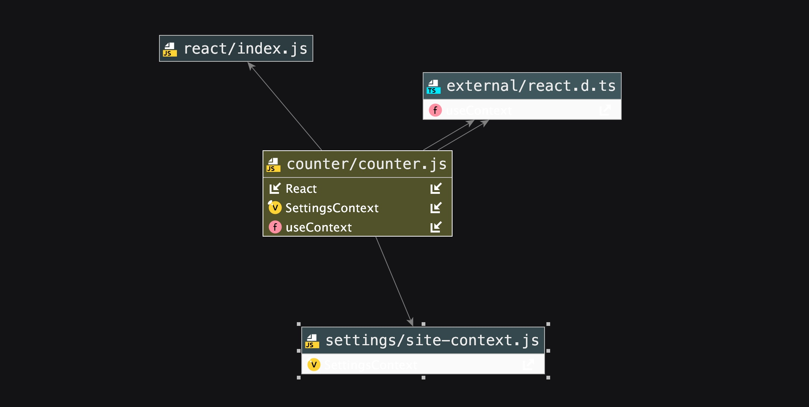

# context_API
A React application that wraps the entire <App/> with a context provider, created using Context API. 
LAB - Context API

## Author: Alistair Blake

Practice - Make a counter app with Context

* Created a Counter Provider Context component, which exposes the following state:
count - A number (default to 0)
* incremented - A reference to a function that increases the count
* decremented - A reference to a function that decreases the count
* In the index.js, imported CounterContext and wrap <App /> in it, so that all child components can optionally 
subscribe to it as consumers.
* <App /> component pulls in and renders the following child components ...
* Created the following child components that register as a .Consumer to the provided context.
1. <Counter /> - Renders the current value of count from the Counter Provider
2. Create this as a class component
3. Used the contextType static declaration to gain access to context.
4. <Incrementer /> - Renders a button that, when clicked, calls the increment() method in the Counter Provider
5. Created this as a function component
6. Used <CounterContext.Consumer> as a wrapper in your render() method to attach to context, along with the function to pull and use context, rendering your output.
7. <Decrementer /> - Renders a button that, when clicked, calls the decrement() method in the Counter Provider
8. Create this as a function component
9. Used the useContext hook to attach to and use context
10. Provided good styling. Use the css-in-js methodology within the components themselves.
11. To Do Application Refactor

## UML
